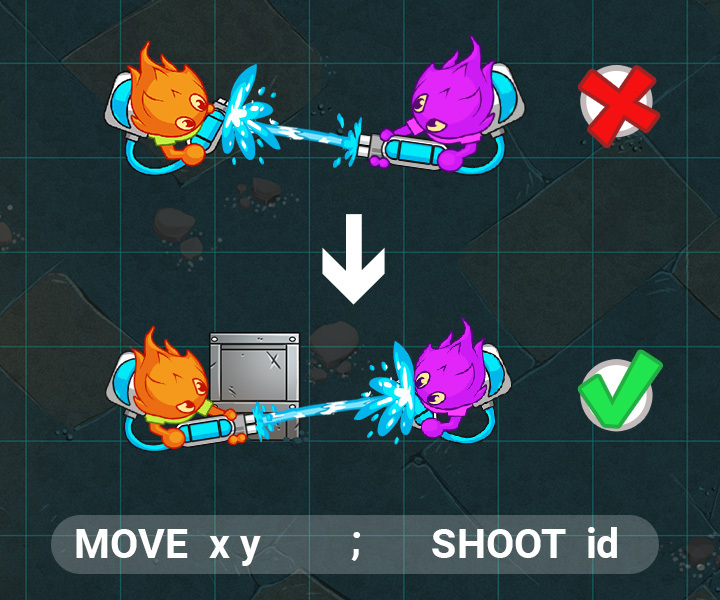
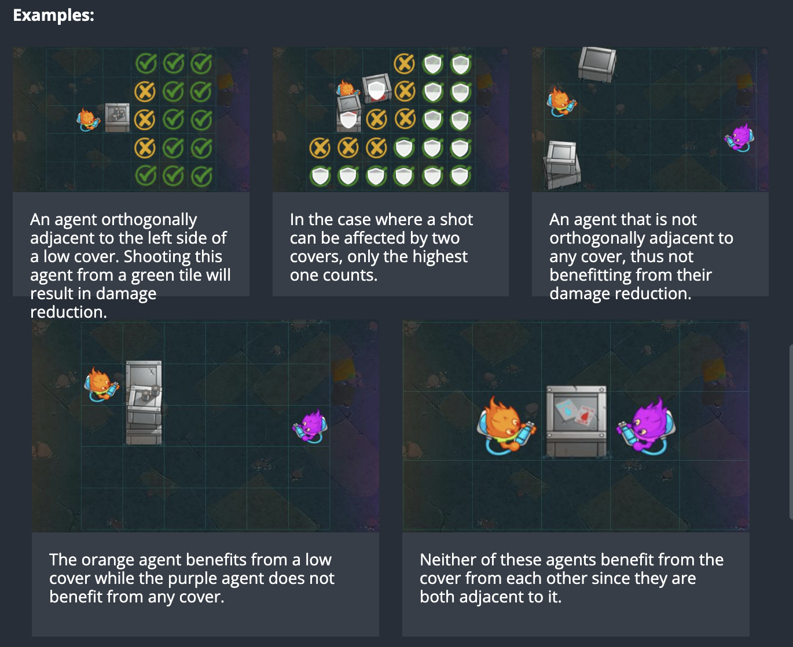

This is a league based challenge.

For this challenge, multiple leagues for the same game are available. Once you have proven your skills against the first Boss, you will access a higher league and extra rules will be available.

NEW: In wooden leagues, your submission will only fight the boss in the arena. Complete the objective specified in each league at least 3 times out 5 to advance to the next league.

# Goal
In this league, you have 1 turn to get both your agents behind the best cover then shoot the opposing enemy with the least protection from cover.

# Rules
The game is played on a grid.

Each player controls a team of agents.

## Objective 3: Taking Cover

Your agents can shoot enemy agents! In this next league, you will have to deal with cover.

🛡️ Cover
Each tile of the grid is given to your program through the standard input. For each column of each row you are given a tileType. It can now have one of three possible values:

0 an empty tile.
1 a tile containing low cover.
2 a tile containing high cover.
Tiles with cover are impassable, and agents will automatically path around them when perform a MOVE action.

An agent that benefits from a cover will gain damage reduction against enemy shots. Low Covers provide 50% protection, and High Covers provide 75% protection.

For instance, an agent within optimal range and a soaking power of 24 will only deal 6 wetness to an enemy behind High Cover.

To benefit from a cover, the agent must be orthogonally adjacent to it, and the enemy shot must come from the opposite side of the cover tile. The cover is ignored if both agents are adjacent to the cover.

In the case where multiple covers can be considered, only the highest cover will count.

Examples:

An agent orthogonally adjacent to the left side of a low cover. Shooting this agent from a green tile will result in damage reduction.

In the case where a shot can be affected by two covers, only the highest one counts.

An agent that is not orthogonally adjacent to any cover, thus not benefitting from their damage reduction.

The orange agent benefits from a low cover while the purple agent does not benefit from any cover.

Neither of these agents benefit from the cover from each other since they are both adjacent to it.
Run & Gun
From this league onwards, your agents may perform both a MOVE and SHOOT action on the same turn. Separate both actions by a semicolon and the assigned agent will first perform the MOVE then immediately attempt to SHOOT from the new position.

Example: 1; MOVE 6 3; SHOOT 4

In this league, you will have agents on either side of the screen. They will both be confronted by two enemy agents in range. They will also be 1 MOVE away from tiles with cover. To beat this league, you must move both agents behind the highest available cover and have them shoot the enemy within range behind the lowest cover.
Victory Conditions
In this league, you will have exactly 1 turn to get both your agents behind the best of two adjacent tiles behind cover then shoot the opposing enemy with the least protection from cover (of the two closest enemies).

Defeat Conditions
Either of your agents moves to the incorrect location or fails to shoot the correct foe.
Your program does not provide a command in the alloted time or one of the commands is invalid.

🐞 Debugging tips
Hover over the grid to see extra information on the tile under your mouse.
Assign the special MESSAGE text action to an agent and that text will appear above your agent.
Press the gear icon on the viewer to access extra display options.
Use the keyboard to control the action: space to play/pause, arrows to step 1 frame at a time.