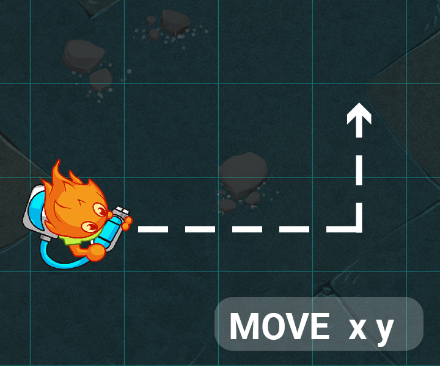
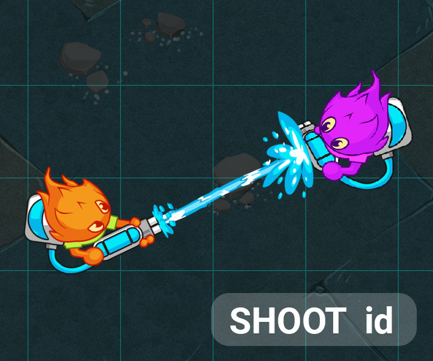

#  This is a league based challenge.

For this challenge, multiple leagues for the same game are available. Once you have proven your skills against the first Boss, you will access a higher league and extra rules will be available.

NEW: In wooden leagues, your submission will only fight the boss in the arena. Complete the objective specified in each league at least 3 times out 5 to advance to the next league.
# Goal
In this league, move one of your agents to the coordinates (6,1), and the other to (6,3).

# Rules
The game is played on a grid.

Each player controls a team of agents.

## Objective 1: the MOVE action

Each one of your agents occupy a tile on the grid. They cannot occupy the same tile. Each agent has a unique agentId.

Each agent can perform one MOVE action per turn. By printing a MOVE x y action to the standard output, you can tell an agent to move one tile towards the given coordinates.

To assign an action to an agent, print to the standard output its agentId followed by the desired action, the two separated by a semicolon.

For example, the following line:
1; MOVE 12 3
will assign the MOVE 12 3 to the agent with agentId = 1.

You must send exactly 1 line per agent on your team.

Grid and agent data are provided to your program through the standard input. Further details in the Game Protocol section.

Victory Conditions
In this league you have two agents on a small grid.
Your objective is to move one of your agents to the coordinates (6,1), and the other to (6,3).
Defeat Conditions
20 turns have passed.
Your program does not provide a command in the alloted time or one of the commands is invalid.

🐞 Debugging tips
Hover over the grid to see extra information on the tile under your mouse.
Assign the special MESSAGE text action to an agent and that text will appear above your agent.
Press the gear icon on the viewer to access extra display options.
Use the keyboard to control the action: space to play/pause, arrows to step 1 frame at a time.

--------------------------------

# Goal
In this league, shoot the enemy agent with the highest wetness on each turn using both your agents.
# Rules
The game is played on a grid.

Each player controls a team of agents.

## Objective 2: the SHOOT action

Your agents can move! In this next league, enemy agents have entered the field!

Thankfully, your agents are also capable of performing the SHOOT action.

In this game, agents can shoot each other with water guns. Shooting an agent will increase its wetness.If an agent's wetness reaches 100 or more, they are removed from the game.

The amount of wetness added to an agent when shot is equal to the soakingPower of the shooter. This can be refered to as damage.

However, that amount will be halved if the manhattan distance separating the two agents is greater than the optimalRangeof the shooter. The shot will fail if the distance is greater than twice the optimalRange, in which case no damage is dealt.

Enemy agents will be present in the list of agents in the standard input. You may identify them with the player variable. You are also given their agentId and wetness. The agents with a value player that equals myId are yours.

The SHOOT id action will tell an agent to shoot the agent with the given id. Each agent can perform one SHOOT action per turn.

Victory Conditions
In this league you have two agents on a small grid. Your objective is to shoot the enemy agent with the highest wetness on each turn using both your agents.
Defeat Conditions
One or more of your agents does not shoot the wettest foe.
Your program does not provide a command in the alloted time or one of the commands is invalid.

🐞 Debugging tips
Hover over the grid to see extra information on the tile under your mouse.
Assign the special MESSAGE text action to an agent and that text will appear above your agent.
Press the gear icon on the viewer to access extra display options.
Use the keyboard to control the action: space to play/pause, arrows to step 1 frame at a time.