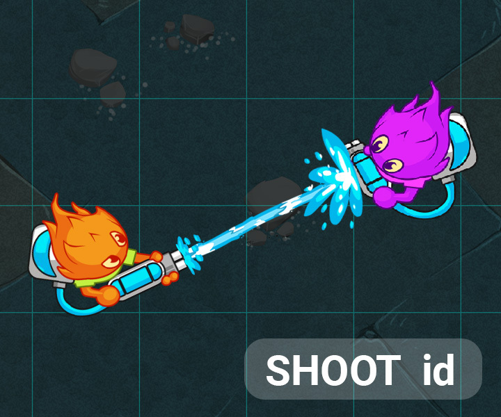

# Goal
In this league, shoot the enemy agent with the highest wetness on each turn using both your agents.
# Rules
The game is played on a grid.

Each player controls a team of agents.

## Objective 2: the SHOOT action

Your agents can move! In this next league, enemy agents have entered the field!

Thankfully, your agents are also capable of performing the SHOOT action.

In this game, agents can shoot each other with water guns. Shooting an agent will increase its wetness.If an agent's wetness reaches 100 or more, they are removed from the game.

The amount of wetness added to an agent when shot is equal to the soakingPower of the shooter. This can be refered to as damage.

However, that amount will be halved if the manhattan distance separating the two agents is greater than the optimalRangeof the shooter. The shot will fail if the distance is greater than twice the optimalRange, in which case no damage is dealt.

Enemy agents will be present in the list of agents in the standard input. You may identify them with the player variable. You are also given their agentId and wetness. The agents with a value player that equals myId are yours.

The SHOOT id action will tell an agent to shoot the agent with the given id. Each agent can perform one SHOOT action per turn.

Victory Conditions
In this league you have two agents on a small grid. Your objective is to shoot the enemy agent with the highest wetness on each turn using both your agents.
Defeat Conditions
One or more of your agents does not shoot the wettest foe.
Your program does not provide a command in the alloted time or one of the commands is invalid.

🐞 Debugging tips
Hover over the grid to see extra information on the tile under your mouse.
Assign the special MESSAGE text action to an agent and that text will appear above your agent.
Press the gear icon on the viewer to access extra display options.
Use the keyboard to control the action: space to play/pause, arrows to step 1 frame at a time.