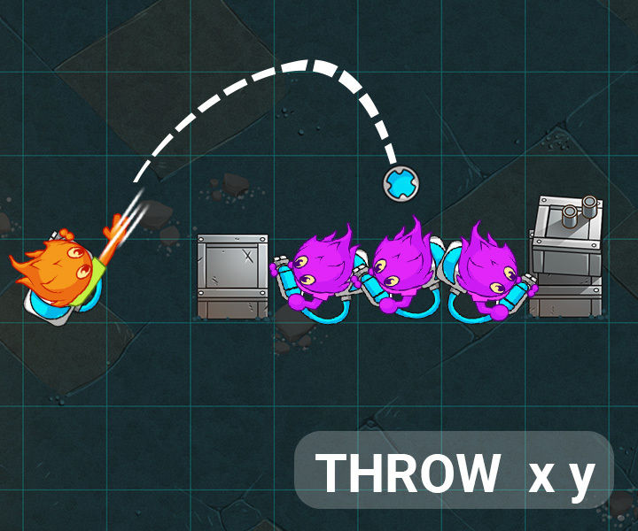

This is a league based challenge.

For this challenge, multiple leagues for the same game are available. Once you have proven your skills against the first Boss, you will access a higher league and extra rules will be available.

NEW: In wooden leagues, your submission will only fight the boss in the arena. Complete the objective specified in each league at least 3 times out 5 to advance to the next league.

# Goal
In this league, eliminate all three groups of only enemy agents with your splash bomb supply.

# Rules
The game is played on a grid.

Each player controls a team of agents.

## Objective 4: Throwing splash bombs

Your agents can now run and gun behind cover! In this new league, throw splash bombs at enemies to deal massive wetness damage regardless of cover.

Agents will sometimes start the game with a number of splash bombs. The current amount of splash bombs for any given agent is given each turn in the standard input as the splashBombs variable.

Throwing a splash bomb is a combat action. Meaning it can be used after a MOVE action, just like the SHOOT action.

An agent using the THROW x y action will attempt to throw a splash bomb at the location x, y. Splash bombs can only be thrown at a maximum distance of 4 tiles away from the agent. They deal 30 wetness to the tile it lands on, and 30 wetness to all adjacent tiles (orthogonally and diagonally).

Victory Conditions
In this league, there are four groups of barricaded agents, one of which includes one of your own agents. You must eliminate all three groups of only enemy agents with your limited splash bomb supply. Shooting is disabled.
Defeat Conditions
You hit any of your own agents.
40 turns have passed.
Your program does not provide a command in the alloted time or one of the commands is invalid.

🐞 Debugging tips
Hover over the grid to see extra information on the tile under your mouse.
Assign the special MESSAGE text action to an agent and that text will appear above your agent.
Press the gear icon on the viewer to access extra display options.
Use the keyboard to control the action: space to play/pause, arrows to step 1 frame at a time.